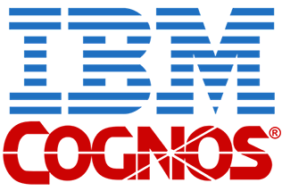

## Welcome to My Github! 👋

### Intro

😄 Pronouns: She/Her/Hers    
💬 Talk me about anything! I am always open to talk and discuss everything.     
🔭 I’m currently working on SQL databases and analysis    
🌱 I’m currently learning cloud computing       
🤔 I’m looking for help with understanding the ins and outs of cloud computing      
⚡ Fun fact: I really like hiking and Marvel Superheros (especially Iron Man)[]    

---

### About Me

Hi again, my name is Alisa Radjabova. I am a Data Analyst/Data Scientist. I have expereience in bringing insight from data and creating new insightful stories. I am a thorough and meticulous Data Analyst passionate about helping businesses succeed by leveraging data analytical skills to improve business performance. Possess strong technical skills rooted in substantial training.

Process-oriented with experience in interpreting and analyzing data to drive growth. Furnish insights, analytics, and business intelligence in clear understandable presentations and dashboards.  Flexible and proficient in documenting, interpreting, and analyzing data in a dynamic environment. 

I have a passion for learning, growing, implementing my analytical skills further.  I am a huge believer in pursuing your curiosity and an even bigger advocate in learning from the people around you.

People always underestimate me, whether it be in my schooling, jobs or even decisions, but I am passionate about everything I dedicate myself to. I strive to absorb everything from every oppertunity I get and am able to outwork my past self each time.

I am always learning, building and growing; I may not know everything there is to know, but I know where to look and I know I will learn it. With that, I love connecting with people and being able to share ideas and thoughts, so please reach out if you want someone to talk to.

---

### Connect With Me  
Whether you have a question or just want someone to talk to about anything related, feel free to reach out :smiley:

 
 

---

### Languages and Tools

 
 

 
 

 
 

***

